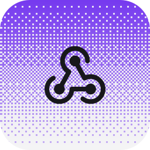

<p align="center">
  <picture>
    <source media="(prefers-color-scheme: dark)" srcset="./icon-dark.png" />
    
  </picture>
</p>

<div align="center">

# Webhooks

</div>

The inbound webhook endpoint registry: resolved public URLs, secret presence, last-delivery times, and ingress backend status.

> **The public home of `ryu-webhooks`.** Source, builds, and releases live here —
> binaries for every platform are attached to each release.
>
> This tree is generated from the Ryu monorepo, so commits pushed here
> directly are replaced on the next sync. **Pull requests are welcome** —
> open them here and they are ported into the monorepo, then flow back out.
> Ryu as a whole: https://github.com/amajorai/ryu

## Install

**App:** [Install](ryu://apps/@ryu/webhooks) (opens the Ryu desktop app and asks you to confirm)

**CLI:**

```bash
ryu apps add @ryu/webhooks
```

## Source & build

This is the **source of record** for the app UI. It imports Ryu's private
`@ryu/ui` design system, so it does **not** build standalone outside the
monorepo — it **builds inside the amajorai/ryu monorepo workspace**.
The **shipped bundle below is the built artifact**: a prebuilt single-file
companion bundle is included at [`dist/webhooks.ui.html`](./dist/webhooks.ui.html) —
the runnable UI Ryu loads for this app.

## License

Apache-2.0 — see [LICENSE](./LICENSE).

## Parts

- **`ui/` — companion (companion-only app, no backend crate).** A sandboxed
  full-page Companion (Path B, `ui_format: "html"`), built to one self-contained
  `dist/index.html` via `vite-plugin-singlefile`. `Webhooks.tsx` drives Core's
  webhook-registry endpoints through the `window.ryu` bridge (no direct `fetch`,
  no node token in the sandbox), listing registered endpoints, their public URLs,
  whether a signing secret is set, and last-delivery timestamps. Each endpoint can
  also read, save, or server-generate its signing secret through an explicit
  protected call; the normal registry response never contains secret material.

There is no dedicated backend crate or sidecar: webhook ingress, URL resolution, and
delivery bookkeeping live in Core; this app is only the surface.

## Manifest (`manifest.json`)

- **Capability grant:** `webhooks:crud` — the bridge capability the companion calls.
- **Runnable:** one `companion` (`Webhooks`, icon `webhook`).

## Surfaces as

A companion route in the shell (label **Webhooks**). It reports the resolved public
ingress URL and per-endpoint secret/delivery state so a user can wire external
producers to a node. Secret values are blurred by default in the editor and reveal
on hover or focus, matching the workspace/user-id concealment pattern without using
code or monospace styling. **Generate** asks Core for a fresh random value; **Save**
accepts a custom value of at least 16 characters. The value must also be entered in
the external sender's signing configuration; the app configures Ryu's verifier.
